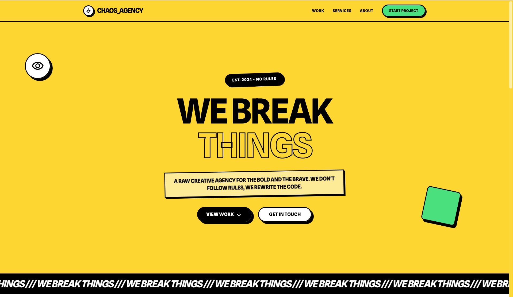

# CHAOS AGENCY

<div align="center">
  
  
  <br />

  
  
  
  
  
</div>

<br />

## ⚡ About The Project
This project is a vibrant, neo-brutalist portfolio website designed for a creative agency. It showcases services and selected works using bold typography, high-contrast colors, and custom animations for a striking visual impact. Built with a modern React stack, it offers a responsive and memorable user experience.

## ✨ Key Features
* 🎯 **Neo-Brutalist Design :** Distinctive aesthetic with bold strokes, vibrant colors, and hard shadows.
* 🚀 **Interactive UI :** Features animated buttons, infinite marquees, and engaging hover effects.
* 🎨 **Responsive Layout :** Fully adaptable interface optimized for all device sizes using Tailwind CSS.

## 🛠️ Built With
* **Front-end :** React, TypeScript, Vite, Tailwind CSS
* **Back-end :** N/A (Frontend Only)

## 🚀 Getting Started
```bash
# Clone the repo
git clone https://github.com/Mid0o03/landingPage_chaos-agency.git

# Install dependencies
npm install

# Run the server
npm run dev
```
